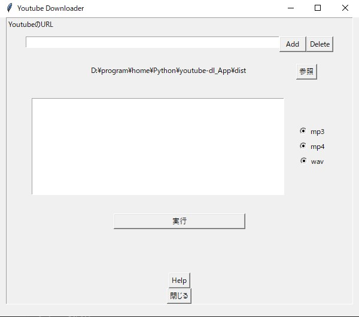

# Youtube Downloader App
## introduction
dist/main.exe  
main.exeを起動するだけで使用することができる  
音声のみをDLする場合は、ffmpegがインストールされていないとエラーが起きる  
ffmpegをインストールするには、  
[ffmpeg公式サイト](https://www.ffmpeg.org/download.html)


## environment
+ youtube-dl: 2021.12.17
+ pyinstaller: 4.7
+ tkinter

## How to use
いつか書く　　


## make exe
```
pyinstaller main.py --onefile <--icon=**> <--noconsole>
```
## Infomation
### version: 1.0.0
+ 現状：とりあえず使えるから公開
+ レイアウト放置
### version: 2.0.0
+ レイアウトざっくりできた
  + ひたすらFrameをネストして無理してると思う
+ URLのリストを表示する場所について
  + message -> listboxに変更
+ help情報をどこにするか考え中